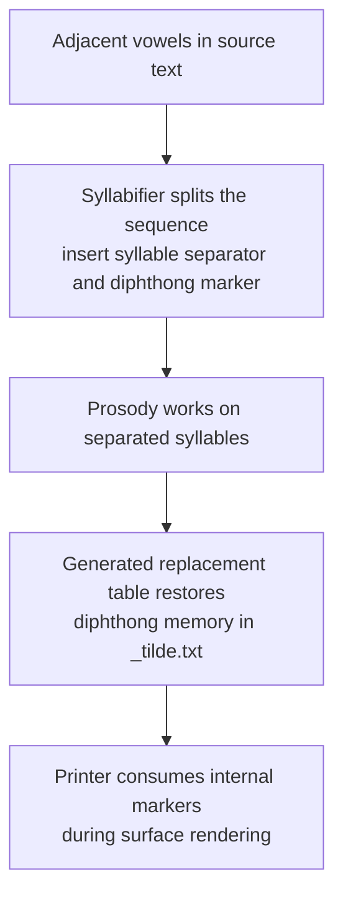

# Diphthong Processing Workflow

## Overview
This document explains how diphthongs are handled by the Akkapros pipeline: how they are split for syllabification, prosody-realized (if necessary), restored into `_tilde` with diphthong memory preserved, and finally rendered in user-facing print outputs.

**Implementation:**
- Generator: `src/akkapros/_gencode/lib_diphthongs.py`
- Generated table: `src/akkapros/lib/diphthongs.py` (via `generate_diphthongs_file()`)

## Flowchart

This flowchart summarizes the active split, restore, and rendering workflow for
diphthong handling. It is generated from repository-owned workflow data and
checked against the current implementation.

<!-- GENERATED FLOWCHART: diphthong-processing -->

<!-- END GENERATED FLOWCHART: diphthong-processing -->

---

## Why Split Diphthongs?

To compute mora counts and apply moraic prosody realization, the syllabifier must treat adjacent vowels as separate syllables. The syllabifier therefore inserts the explicit internal sequence `SYL_SEPARATOR + DIPH_SEPARATOR` between adjacent vowels, making forms like `ua` surface internally as `u·¨a` and keeping the following vowel's onset unambiguous for the prosody realization algorithm.

This diphthong-transition marker is distinct from the separate word-initial hiatus marker `HIATUS_MARKER = '˙'`. `¨` remains diphthong-only; `˙` marks vowel-initial onset structure such as `˙a·na`.

After prosody realization, those two-vowel sequences must be mapped back to the correct orthographic diphthong in the pivot format (e.g., `u¨ā`, `u¨â`, `u¨a`, `u¨ā~`, etc.). The mapping is not trivial: it depends on:

- Vowel quality (short, long, circumflex)
- Whether the second vowel carries a tilde (`~`)
- Interactions where circumflex forms take precedence

---

## High-Level Pipeline

The pipeline consists of four stages in sequence:

1. **Syllabify** – The syllabifier inserts `SYL_SEPARATOR + DIPH_SEPARATOR` between adjacent vowels and separately inserts `HIATUS_MARKER` on vowel-initial words
2. **Prosody Realization** – The algorithm operates on separated syllables, potentially adding tilde markers
3. **Restore Diphthongs in `_tilde`** – Regex replacements convert separated vowel pairs into pivot diphthong forms while preserving `¨`
4. **Print Surface Forms** – The printer consumes these internal markers only after syllable-sensitive rendering, so user-facing printer output remains unchanged

---

## Rules Summary

- Two main cases are handled:
  - **Same-base vowel pairs** (a+a, i+i, etc.)
  - **Different-base pairs** (u+a, a+i, etc.)
- If the second vowel has a tilde, those patterns are matched **first** to avoid shorter patterns shadowing longer, more specific ones.
- **Circumflex forms** take precedence where specified. The mapping chooses the circumflex when either side requires it according to the rule set.
- The result may carry a tilde depending on the interaction between the forms:
  - Example: short first vowel + long/circ second with tilde → result keeps tilde
  - Other combinations may remove or add tilde

---

## Implementation Mapping to Code

| Function | Description |
|----------|-------------|
| `_char(base, form)` | Returns character(s) for a vowel base and form token: `short`, `long`, `circ`, and the `~` variants (`long~`, `circ~`) |
| `_same_vowel_replacement(base, first_form, second_form)` | Rules when both vowels share the same base |
| `_different_vowel_replacement(base1, base2, first_form, second_form)` | Rules for mixed base pairs |
| `_replacement(base1, base2, first_form, second_form)` | Convenience wrapper that dispatches to the appropriate function |
| `_build_entries()` | Enumerates all combinations of bases and forms and produces raw (pattern, replacement, second_has_tilde) tuples |
| `_combine_entries(entries)` | Groups patterns with identical replacements, builds alternations, and sorts entries so second-tilde patterns are first |
| `generate_diphthongs_file(filename)` | Writes the final `ALL_REPLACEMENTS` list into the specified file |

---

## Practical Examples

Here are representative mappings (informal):

### Same-base examples (a + a)

| Input | `_tilde` Output | Interpretation |
|-------|--------|----------------|
| `a.SEP.¨ā~` | `ā` | short + long~ → long without tilde |
| `ā.SEP.¨â~` | `â~` | long + circ~ → circ with tilde |
| `a.SEP.¨a` | `â` | short + short → circumflex |

### Mixed-base examples (u + a)

| Input | `_tilde` Output | Interpretation |
|-------|--------|----------------|
| `u.SEP.¨ā~` | `u¨ā~` | short u + long~ a → uā~ with diphthong memory preserved |
| `ū.SEP.¨ā~` | `u¨ā` | long ū + long~ a → uā with diphthong memory preserved |
| `u.SEP.¨a` | `u¨a` | short u + short a → ua with diphthong memory preserved |

**Note:** `SEP` above stands in for the actual `SYL_SEPARATOR + DIPH_SEPARATOR` sequence produced during syllabification.

Word-initial hiatus uses a different marker entirely. For example, `ana` syllabifies as `˙a·na`, not as a diphthong-memory form.

---

## Regenerating the Replacement File

To regenerate `diphthongs.py` from the generator, run the module from the repository root:

  python -m akkapros._gencode.lib_diphthongs

This will:
1. Write `src/akkapros/lib/diphthongs.py`
2. Print a summary of how many combined regex rules were generated (counts for second-tilde vs plain patterns)

---

## Notes and Cautions

- The generator produces **regex patterns**; the restoration stage must apply them using the same regex flavor and with the same notion of separators.
- **Pattern ordering is critical**: always apply second-tilde patterns first to prevent incorrect substitutions.
- `_tilde` is the pivot format: keep `¨` there for diphthong memory, keep `˙` there for word-initial hiatus where present, and let downstream renderers consume those internal markers without changing printer or metricalc outputs.
- If vowel inventories or form tokens are extended, update both:
  - The generator (`BASES`, `VOWELS`, `FIRST_FORMS`, `SECOND_FORMS`)
  - Tests that cover the new combinations

---

## Further Reading

- Implementation: `src/akkapros/_gencode/lib_diphthongs.py`
- Generated table: `src/akkapros/lib/diphthongs.py` (contains the `ALL_REPLACEMENTS` table used at runtime)

---

## Changelog

| Date | Description |
|------|-------------|
| 2026-03-13 | Initial documentation describing generation rules and how the restoration fits into the syllabify/prosody realization pipeline |