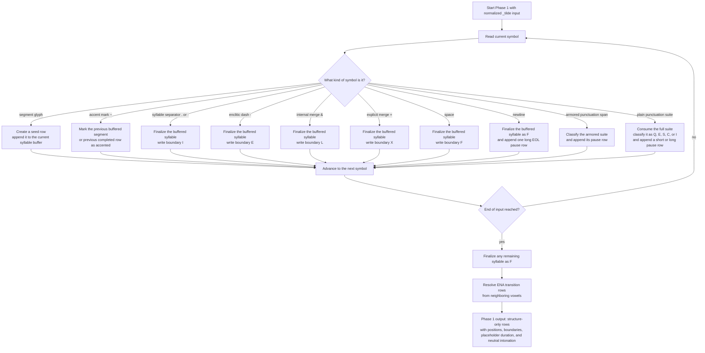

# Phonetizer Algorithm

This document describes the live phonetizer solver used by the `phonetizer`
stage and by `fullprosmaker` during phonetization.

The practical question is simple: once prosody has already been fixed in
`_tilde.txt`, how are concrete phone-row durations and row-level intonation
assigned?

This page describes current user-facing behavior only. Beat folding is part of
the fixed solver, not a user policy surface, and checkpoints separated by one
full `cvc_reference` remain synchronization-equivalent beat positions.

## Flowchart

This flowchart summarizes the live phonetizer workflow at user-facing stage
level. It is generated from repository-owned workflow data and checked against
the current implementation.

<!-- GENERATED FLOWCHART: phonetizer-algorithm -->


<!-- END GENERATED FLOWCHART: phonetizer-algorithm -->

## Scope

The phonetizer produces two phone-row streams from one `_tilde` input:

- `<prefix>_ophone.txt` for the derived original stream
- `<prefix>_phone.txt` for the accentuated stream

Both streams use the same row contract and the same Phase 2 duration solver.
The difference is only structural input:

- the accentuated stream preserves `~`, `&`, `+`, `·`, and `-`
- the original stream is derived by removing `~` and replacing internal merge
  marks `&` with spaces while preserving explicit lexical merges `+`

## Row Model

Each output row uses this flat-line format:

```text
label|category|type|length|position|boundary|accent|realization|duration|drift|intonation|text
```

Important fields:

- `category` is `C`, `V`, or `S`
- `position` is onset `O`, coda `C`, nucleus `N`, or silence `S`
- `boundary` records the closing structure carried by the row
- `duration` is the Phase 2 millisecond result
- `drift` is the post-unit drift token written after the most recently completed syllable or pause
- `intonation` is the Phase 3 row token
- `text` preserves the source glyph, punctuation suite, `<EOL>`, or the
  inserted mini-pause marker

Pause rows use the same code inventory as before:

- short-like pauses use `SES` / `SP`
- long pauses and line breaks use `ZEN` / `ZP`

The phonetizer may also insert a non-punctuation mini-pause row during Phase 2.
That row is a phone-row artifact only. It is not part of lexical structure and
is ignored when reconstructing upstream `_tilde` text from finalized rows.

## Shared Validation Boundary

Before standalone phonetizer runtime enters Phase 2, the effective grouped
config is passed through the shared semantic verification layer also used by
`confwriter --verify`.

That layer validates the current live timing model, including:

- enum-like process-policy values
- positive integer timing leaves
- validation-only `segmental_floor` lower bounds for vowel minima, consonant anchors and minima, and hiatus/transition special realizations
- class-local consonant `gemination_max` ordering and `segmental_ceiling` checks
- consonant and vowel ordering constraints
- pause-band ordering
- short- and long-pause compatibility against `cvc_reference`
- the non-negative integer requirement for `drift_tolerance`

The live default now sets `drift_tolerance = 0`.

When `DEBUG_CHRONO` is enabled in the library constants, runtime also enforces
a checkpoint integrality invariant at every syllable-final and pause row. At
each checkpoint, the value

```text
2 * (cumulative_duration - drift)
```

must be divisible by `cvc_reference`. If it is not, runtime fails immediately.
This is a debug invariant for the beat model itself, not a soft warning.

## Timeline Model

Phase 2 is a timeline solver organized around one beat reference:

- `cvc_reference`

The nominal non-accentuated targets are:

- `CV = 0.5 * cvc_reference`
- `CVC = 1.0 * cvc_reference`
- `CVV = 1.0 * cvc_reference`
- `CVVC = 1.5 * cvc_reference`

Accentuated shapes still add exactly `0.5 * cvc_reference` beyond the matching
non-accentuated target.

Current legality limits also distinguish validation bounds from runtime caps:

- adjacent accent spill into a short vowel is legal only up to `long_min - 1`
- under the live defaults, `long_min = 153`, so the maximum adjacent short-vowel outcome is `152 ms`
- runtime consonant saturation uses class-local `perception_limits.gemination_max`
- `segmental_ceiling` remains a validation ceiling rather than the runtime consonant cap
- `segmental_floor` remains a validation-only lower bound and is not used as a runtime timing control

The solver carries one signed running value, `drift_cursor`:

- negative drift means the stream is ahead of the beat
- positive drift means the stream is behind the beat

Synchronization is modulo the beat reference. The checkpoints
`-cvc_reference`, `0`, and `+cvc_reference` are equivalent from the solver's
point of view because each one lands on a beat boundary separated by one full
foot.

The serialized row-level `drift` field uses a fixed-width token:

- `+000` for exactly on the beat after row-token rounding
- `-xyz` for `xyz` ms ahead of the beat
- `+xyz` for `xyz` ms behind the beat

Rows that do not close a syllable or pause repeat the most recent completed-unit token. The token becomes newly informative only on syllable-final rows and pause rows.

Under `DEBUG_CHRONO`, those syllable-final and pause rows are also the enforced
checkpoint rows. They must land on the integer beat lattice implied by
`cvc_reference`; otherwise the solver raises a checkpoint mismatch error.

## Phase 1: Row Building

The visual summary below follows the live row-building loop: what each input
symbol class does to the current syllable buffer, when a syllable is closed,
and when a pause row is emitted.

<!-- GENERATED FLOWCHART: phonetizer-phase1-row-building -->


<!-- END GENERATED FLOWCHART: phonetizer-phase1-row-building -->

The row builder is structure-first.

It does not assign timings yet. It only materializes rows with:

- placeholder duration `0000`
- neutral intonation `M0C`
- explicit syllable and boundary structure

Boundary behavior remains:

- `I` for internal syllable breaks
- `E` for enclitic dashes
- `L` for internal merges (`&`)
- `X` for explicit merges (`+`)
- `F` for prosodic-unit endings

Punctuation suites are classified once by pause precedence:

- `Q > E > S > C > I`

The builder also normalizes a missing terminal line break into one final
`<EOL>` long-pause row.

## Phase 2: Duration Solver

The visual summary below follows the live realization loop: how pause units and
syllable units branch, where long-vowel correction and accentuation can occur,
and when drift is folded or carried forward.

<!-- GENERATED FLOWCHART: phonetizer-phase2-duration-solver -->


<!-- END GENERATED FLOWCHART: phonetizer-phase2-duration-solver -->

### Overview

Phase 2 partitions the prebuilt stream into syllables and pauses. It then walks
left to right and updates `drift_cursor` after each realized unit.

The solver is conservative about what may move:

- consonants are hard anchors
- short vowels are also hard anchors
- long vowels remain the only syllable-internal recovery space
- pauses remain inter-unit recovery space

This is the key current rule: ordinary drift recovery never changes a short
vowel.

### Step Order

For each syllable unit, the solver does the following.

1. Assign baseline onset anchors.
2. Assign coda anchors if present.
3. Assign the nucleus anchor.
4. If the coda is followed by the same onset consonant, pre-assign the next
   onset through the geminate policy.
5. Compute the current non-accentuated syllable target from the beat mapping.
6. Compute signed post-assignment drift:

```text
drift_after_assignment = drift_cursor + (realized_total - shape_ref)
```

1. Do not fold drift inside a merged prosodic unit. Internal syllables carry
  raw drift forward until the unit-closing `F` syllable is complete.

1. After the closing `F` syllable of the prosodic unit has been fully realized,
  fold the completed-unit drift to the nearest equivalent beat branch:

```text
if drift_after_assignment > round_half_up(0.5 * cvc_reference):
  drift_after_assignment -= cvc_reference
if drift_after_assignment < -round_half_up(0.5 * cvc_reference):
  drift_after_assignment += cvc_reference
```

This keeps the completed-unit drift inside the canonical interval centered on
the nearest beat. Folding is always modulo the current `cvc_reference`.
For example, with `cvc_reference = 300`, `+250` folds to `-50` because reaching
`+300` is nearer than returning to `0`, while `-250` folds to `+50` because
reaching `-300` is nearer than returning to `0`. Likewise, `-297` folds to
`+3` when `cvc_reference = 300` because `-297 + 300 = 3`.

The crucial restriction is timing: this fold is prosodic-unit-final, not
syllable-local. If a syllable closes with `L`, `X`, `E`, or `I`, its raw drift
is carried into the next syllable because the merged unit is not complete yet.

1. If unresolved absolute drift still exceeds `drift_tolerance`, apply ordinary
  vowel correction only if the nucleus is long.
1. If the stream is accentuated and this syllable carries accentuation,
  distribute an accent increment computed as:

```text
AA = round_half_up(0.5 * cvc_reference)
```

The signed drift value at accent-distribution entry is still tracked, but it no
longer reduces `AA` before distribution. If legality caps prevent the full
target from being realized locally, the solver preserves the configured
primary/adjacent ratio, realizes the largest legal proportional increment, and
keeps the remaining shortfall in drift.

1. If the current boundary is eligible and the stream is synchronized at the
  completed `F` boundary, optionally insert one mini pause using the
  equivalent-beat rule.

### Hard Short Vowels

The implementation now treats short vowels as fixed anchors.

Operationally, that means the legal ordinary-recovery bounds for a short vowel
collapse to the configured short-vowel anchor itself. The short vowel is not
shortened, lengthened, or used as a hidden local repair buffer.

Consequences:

- `CV` and `CVC` syllables may leave substantial drift behind
- that drift must be discharged later by a long vowel, a punctuation-owned
  pause, a mini pause, or retained drift

### Long-Vowel Recovery

Long vowels still provide ordinary syllable-internal flexibility.

Their legal recovery space now depends on why the vowel is moving.

For ordinary non-accentual recovery in `CVV` and `CVVC`, the solver may move a
long vowel only inside:

- `long_min .. very_long_min - 1`

This means ordinary recovery may use the long vowel as local slack, but it may
not push that vowel into the very-long category. If more correction would still
be needed after reaching `very_long_min - 1`, the unresolved mismatch remains in
drift.

Accentuation legality is broader. Accentuated long-vowel targets still use the
configured contextual maximum when the accent distribution step has legal room.

### Accentuation Routing

Accentuation still uses the half-foot reference, but the target quantity is now
independent of entry drift.

Increment quantity:

- `AA = round_half_up(0.5 * cvc_reference)`
- `round_half_up` means halves round up (`2.5 -> 3`)

What did not change:

- the existence of a primary/adjacent distribution-policy family
- the same-consonant handling logic around coda/onset pairs

What did change:

- short vowels are not accentuation targets
- the allowed policy family is now `100_0`, `95_05`, `90_10`, `85_15`, `80_20`, `75_25`, and `70_30`
- the default policy is `80_20`
- when legality caps block the full target, the solver scales the total local increment down to the largest value that preserves the configured ratio instead of greedily spending leftover slack on one segment

So the extra mora is realized through accentable consonants or long-vowel space
only.

Primary/adjacent routing by accent shape:

- `C:V` -> primary `C`, adjacent `V`
- `CVV:` -> primary `VV`, adjacent preceding `C`
- `CVC:` -> primary final `C`, adjacent preceding `V`
- `CVV:C` -> primary `VV`, adjacent following `C`

### Pause Realization

Punctuation-owned pauses still use legal pause bands.

- short pause band: `pauses.short.min .. pauses.short.max`
- long pause band: `pauses.long.min .. pauses.long.max`

The solver chooses one legal value inside the active band that brings signed
drift as close to zero as the band allows.

This has two important consequences:

- if zero drift is reachable inside the band, the realized pause lands there
- if zero drift is not reachable, the pause clamps inside the band and carries
  residual drift forward

Long pauses no longer have a special conceptual status beyond their wider band.
They usually reset drift in normal configurations because their legal space is
much larger, but the rule is still "closest legal discharge," not an automatic
magical reset.

### Mini Pauses

Mini pauses are non-punctuation recovery gaps inserted by the phonetizer.

They are not lexical phoneme structure and are not punctuation-owned pauses.

The live solver inserts at most one mini pause at an eligible boundary when all
of the following are true:

- the next unit is another syllable, not an existing pause row
- the current syllable ends at a plain word boundary (`F`)

Mini pauses use the same beat-equivalence logic as drift folding.

If the current drift is negative, the target checkpoint is `0`, so the legal
mini-pause duration must be exactly `abs(drift)`.

If the current drift is positive, the target checkpoint is `+cvc_reference`, so
the legal mini-pause duration must be exactly `cvc_reference - drift`.

The mini pause is inserted only when that exact target duration lies inside:

- `pauses.mini.min .. pauses.mini.max`

When inserted, the pause lands the stream on an equivalent beat checkpoint,
which then folds back to zero drift in the canonical interval. Because mini
pauses are only eligible at plain `F` boundaries, they are always evaluated
after the merged prosodic unit has been completed and folded.

The default mini band is:

- `pauses.mini.min = 100`
- `pauses.mini.max = 200`

## Worked Examples

### Baseline `qat`

With the default timing model, `qat` is realized as one closed syllable plus
the normalized terminal `<EOL>` row.

The consonantal anchors contribute `89 + 87 = 176 ms`, the short vowel stays
fixed at `110 ms`, and the closed syllable therefore realizes as `286 ms`.

Its nominal `CVC` target is one `cvc_reference`, or `300 ms`, so the stream
leaves the syllable with `-14 ms` of drift before the terminal long pause is
processed.

### Short vowels no longer absorb local mismatch

Consider a diagnostic setup with:

- `cvc_reference = 350`
- ordinary `qat`

The segment anchors still sum to `286 ms`, so the syllable is `64 ms` ahead of
the beat.

Under the live solver, the short vowel remains `110 ms`. That mismatch is not
hidden inside the vowel. It must be discharged later.

### Long vowels still can

For a long-vowel syllable such as `qā`, the nucleus remains legal recovery
space. If the beat target demands more duration and the configured long-vowel
range still has room, the solver may extend that long vowel before carrying any
remaining drift forward.

### Mini-pause examples

With a diagnostic mini band of `50 .. 80 ms` and `cvc_reference = 350`, the
sequence `qat pa` leaves the first word `54 ms` ahead of the beat.

Because that boundary is a plain word boundary, the next unit is another
syllable, and no punctuation-owned pause already exists there, the phonetizer
may insert one `54 ms` mini pause before `pa`.

Positive drift works the same way against the next equivalent checkpoint.
With `cvc_reference = 300`, the syllable `ša` realizes `72 ms` behind the beat.
If the mini band includes `228 ms`, the phonetizer may insert one `228 ms`
mini pause because `72 + 228 = 300`, and `+300` is synchronization-equivalent
to `0` after beat folding.

That mini pause is visible in the phone-row stream but not in reconstructed
upstream `_tilde` text.

Under the current row contract, an inserted mini pause is emitted as a
dedicated silence row such as `MEN|S|M|S|S|N|P|MP|0064|+000|M0C|<space>`.
The last field is one literal space character, not a named sentinel token.

## Phase 3: Intonation

Intonation remains a separate pass over duration-bearing rows.

The accentuated stream assigns row-level contour from:

- lexical stress when no pause-final override applies
- question pauses
- statement pauses
- exclamation pauses
- continuation pauses

Internal pauses, including inserted mini pauses, do not impose a clause-final
contour.

The original stream remains neutral in the current scope.

## Post-Unit Drift Reporting

Finalized front matter carries the phonetizer post-unit drift summary for each emitted
stream:

- `metadata.data.phonetize.post_unit_drift.max`
- `metadata.data.phonetize.post_unit_drift.mean`
- `metadata.data.phonetize.post_unit_drift.stddev`
- `metadata.data.phonetize.post_unit_drift.current`
- `metadata.data.phonetize.post_unit_drift.label`
- `metadata.data.phonetize.post_unit_drift_extension_count`
- `metadata.data.phonetize.post_unit_drift_extension_denominator`
- `metadata.data.phonetize.post_unit_drift_extension_rate`
- `metadata.data.phonetize.max_post_unit_drift_extension`

The same front matter now also carries denominator-aware recovery diagnostics:

- `syllable_unit_count`, `pause_unit_count`, `mini_pause_row_count`, and `completed_unit_count`
- `ordinary_vowel_correction_count`, denominator, and rate
- `mini_pause_insert_count`, denominator, and rate
- `pause_residual_post_unit_drift_count`, denominator, and rate

Denominator meanings are fixed by the runtime control flow rather than by row totals:

- post-unit drift extension is measured over realized syllable units
- ordinary vowel correction is measured over long-vowel syllables where ordinary correction was considered
- mini-pause recovery is measured over structurally eligible `F`-boundary syllables
- pause residual carry is measured over non-mini pause units

## Metrics Handoff

`metricalc` consumes `_ophone.txt` and `_phone.txt` as the active downstream
inputs.

That means the phonetizer owns the duration-bearing representation used for:

- interval metrics
- pause totals
- post-unit drift reporting
- downstream printer and MBROLA export

See also: `docs/akkapros/phonetizer-phone-file-guide.md`
