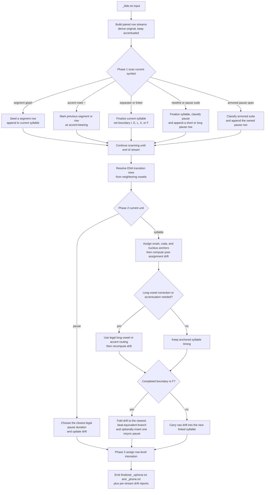
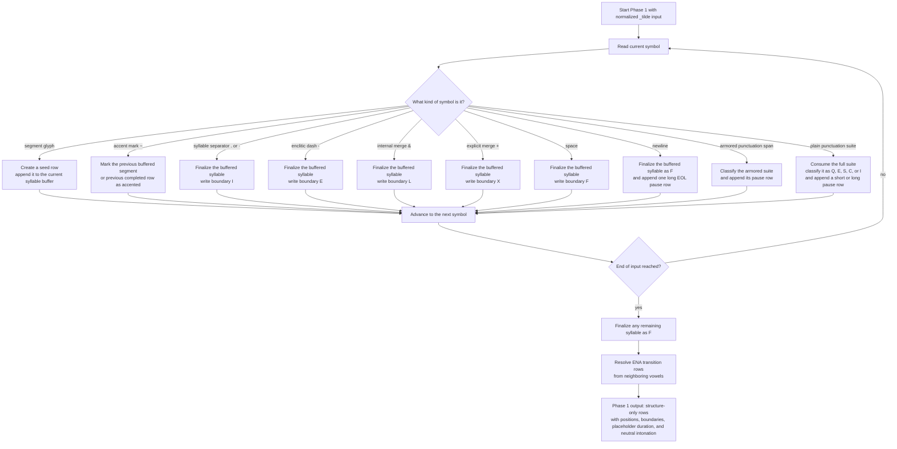
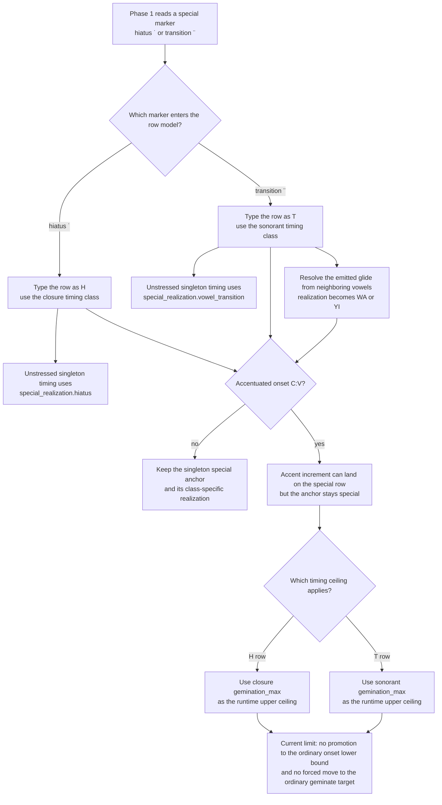
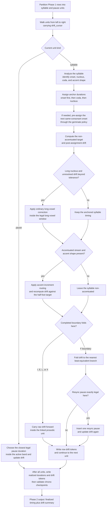

# Phonetizer Algorithm

This document describes the live phonetizer solver used by the `phonetizer`
stage and by `fullprosmaker` during phonetization.

The practical question is simple: once prosody has already been fixed in
`_tilde.txt`, how are concrete phone-row durations and row-level intonation
assigned?

This page describes current user-facing behavior only. Beat folding is part of
the fixed solver, not a user policy surface. The active synchronization basis
is stream-aware: the accentuated stream uses `cvc_reference` in bimoraic mode
and `0.5 * cvc_reference` in monomoraic mode, while the original stream uses
`0.5 * cvc_reference` throughout.

## Flowchart

This flowchart summarizes the live phonetizer workflow at user-facing stage
level. It is generated from repository-owned workflow data and checked against
the current implementation.

<!-- GENERATED FLOWCHART: phonetizer-algorithm -->


<!-- END GENERATED FLOWCHART: phonetizer-algorithm -->

## Scope

The phonetizer produces two phone-row streams from one `_tilde` input:

- `<prefix>_ophone.txt` for the derived original stream
- `<prefix>_phone.txt` for the accentuated stream

Both streams use the same row contract and the same Phase 2 duration solver.
The difference is only structural input:

- the accentuated stream preserves `~`, `&`, `+`, `·`, and `-`
- the original stream is derived by removing `~` and replacing internal merge
  marks `&` with spaces while preserving explicit lexical merges `+`

After Phase 1 resolves positions, boundaries, and transition rows, the live
pipeline runs one dedicated vowel-coloring pass before Phase 2. That pass owns
all emphatic vowel-coloring decisions for both streams, including onset-based
coloring and the optional coda-driven extension controlled by
`phonetize.process.realization.limit_emphatic_coloring`.

## Row Model

Each output row uses this flat-line format:

```text
label|category|type|length|position|boundary|accent|realization|duration|drift|intonation|text
```

Important fields:

- `category` is `C`, `V`, or `S`
- `position` is onset `O`, coda `C`, nucleus `N`, or silence `S`
- `boundary` records the closing structure carried by the row
- `duration` is the Phase 2 millisecond result
- `drift` is the unit-drift token written after the most recently completed syllable or pause
- `intonation` is the Phase 3 row token
- `text` preserves the source glyph, punctuation suite, `<EOL>`, or the
  inserted resync-pause marker

Pause rows use the same code inventory as before:

- short-like pauses use `SES` / `SP`
- long pauses and line breaks use `ZEN` / `ZP`

The phonetizer may also insert a non-punctuation resync-pause row during Phase 2.
That row is a phone-row artifact only. It is not part of lexical structure and
is ignored when reconstructing upstream `_tilde` text from finalized rows.

## Shared Validation Boundary

Before standalone phonetizer runtime enters Phase 2, the effective grouped
config is passed through the shared semantic verification layer also used by
`confwriter --verify`.

That layer validates the current live timing model, including:

- enum-like process-policy values
- positive integer timing leaves
- validation-only `segmental_floor` lower bounds for vowel minima, consonant anchors and minima, and hiatus/transition special realizations
- class-local consonant `gemination_max` ordering and `segmental_ceiling` checks
- consonant and vowel ordering constraints
- pause-band ordering
- short- and long-pause compatibility against the active synchronization bases derived from `cvc_reference`
- the non-negative integer requirement for `drift_tolerance`

The live default now sets `drift_tolerance = 19`.

When `DEBUG_CHRONO` is enabled in the library constants, runtime also enforces
a checkpoint integrality invariant at every syllable-final and pause row. At
each checkpoint, the value

```text
2 * (cumulative_duration - drift)
```

must be divisible by `cvc_reference`. If it is not, runtime fails immediately.
This is a debug invariant for the beat model itself, not a soft warning.

## Timeline Model

Phase 2 is a timeline solver organized around one heavy-syllable reference and
one active synchronization basis.

The heavy-syllable reference stays fixed:

- `cvc_reference`

The active synchronization basis is derived at runtime:

- accentuated stream with `mora_mode = bi`: `cvc_reference`
- accentuated stream with `mora_mode = mono`: `0.5 * cvc_reference`
- original stream in `_ophone.txt`: `0.5 * cvc_reference`

The nominal non-accentuated targets are:

- `CV = 0.5 * cvc_reference`
- `CVC = 1.0 * cvc_reference`
- `CVV = 1.0 * cvc_reference`
- `CVVC = 1.5 * cvc_reference`

Accentuated shapes still add exactly `0.5 * cvc_reference` beyond the matching
non-accentuated target, except in mono mode where the accentuation increment is
`basic_accentuation_lengthening` (default 50 ms) instead of `0.5 * cvc_reference`.

### Global Duration Scale

All numeric duration leaves in the timing model are subject to a global
`duration_scale` multiplier (default `1.0`, no-op). When `duration_scale` is
not `1.0`, every integer and float leaf in the durations tree is multiplied by
the scale factor before any runtime computation. The `drift_tolerance` value is
rounded to the nearest integer after scaling. The `scale` key itself is excluded
from scaling.

The effective durations are derived once at runtime entry by
`_derive_effective_durations` and cached for the duration of the phonetizer
pass. This means all consonant anchors, vowel anchors, geminate targets,
perception limits, pause bands, and special-realization values are uniformly
scaled.

Current legality limits also distinguish validation bounds from runtime caps:

- adjacent accent spill into a short vowel is legal only up to `long_min - 1`
- under the live defaults, `long_min = 153`, so the maximum adjacent short-vowel outcome is `152 ms`
- runtime consonant saturation uses class-local `perception_limits.gemination_max`
- `segmental_ceiling` remains a validation ceiling rather than the runtime consonant cap
- `segmental_floor` remains a validation-only lower bound and is not used as a runtime timing control

The solver carries one signed running value, `drift_cursor`:

- negative drift means the stream is ahead of the beat
- positive drift means the stream is behind the beat

Synchronization is modulo the active synchronization basis. The checkpoints
`-basis`, `0`, and `+basis` are equivalent from the solver's point of view
because each one lands on a beat boundary separated by one active beat.

The serialized row-level `drift` field uses a fixed-width token:

- `+000` for exactly on the beat after row-token rounding
- `-xyz` for `xyz` ms ahead of the beat
- `+xyz` for `xyz` ms behind the beat

Rows that do not close a syllable or pause repeat the most recent completed-unit token. The token becomes newly informative only on syllable-final rows and pause rows.

Under `DEBUG_CHRONO`, those syllable-final and pause rows are also the enforced
checkpoint rows. The debug invariant is still expressed through
`cvc_reference`, but the active synchronization lattice may now be the full
beat or the half beat derived from that same heavy-syllable reference.

## Phase 1: Row Building

The visual summary below follows the live row-building loop: what each input
symbol class does to the current syllable buffer, when a syllable is closed,
and when a pause row is emitted.

<!-- GENERATED FLOWCHART: phonetizer-phase1-row-building -->


<!-- END GENERATED FLOWCHART: phonetizer-phase1-row-building -->

Immediately after that structure-only output is available, the phonetizer runs
its realization pass to color vowel rows from emphatic onsets and, when the
flag is enabled, from emphatic codas plus one immediate carried syllable inside
the same punctuation-bounded continuity span.

### Proto-Semitic Pharyngeal/Glottal Replacement

The phonetizer supports an experimental config key
`phonetize.process.realization.replace_proto_semitic` (default `false`) that
merges the realization codes for three pharyngeal/glottal consonants into the
same glottal-stop code `AL` (ʔ):

| Label | Glyph | Default Realization | Replacement Realization |
|-------|-------|---------------------|-------------------------|
| `ETE` | `ḥ`   | `ET` (ħ)            | `AL` (ʔ)                |
| `AIN` | `ʿ`   | `AI` (ʕ)            | `AL` (ʔ)                |
| `ALE` | `ʾ`   | `AL` (ʔ)            | `AL` (ʔ, unchanged)     |
| `HET` | `ḫ`   | `HE` (χ)            | `HE` (χ, unchanged)     |

When `replace_proto_semitic` is `true`, the replacement is applied during
Phase 1 row building, at the point where each segment glyph's realization code
is assigned. This means the replacement affects both the accentuated
(`_phone.txt`) and original (`_ophone.txt`) streams, and propagates to all
downstream consumers (IPA, MBROLA `.pho`, XAR, acute, bold) without requiring
separate mapping in each consumer.

The printer inherits the proto-Semitic replacement from the phonetizer output
and no longer has its own `--ipa-proto-semitic` option. The printer's IPA
mapping uses a single `IPA_MAP` that directly translates realization codes to
IPA symbols. When the phonetizer has `replace_proto_semitic: true`, the
realization codes in the phone rows already reflect the merged pharyngeal/
glottal mapping (`AL` for ḥ/ʿ/ʾ, `HE` for ḫ), and the printer translates those
codes to IPA without any additional preserve/replace branching.

This key is guarded by `phonetize.process.allow_experimental`: setting
`replace_proto_semitic` to `true` requires `allow_experimental = true`. When
`allow_experimental` is `false` and `replace_proto_semitic` is `true`, the
phonetizer config verification reports a failure.

The replacement does not affect other phonemes, hiatus markers (`˙`),
vowel-transition markers (`¨`), or emphatic vowel coloring logic.

The row builder is structure-first.

It does not assign timings yet. It only materializes rows with:

- placeholder duration `0000`
- neutral intonation `M0C`
- explicit syllable and boundary structure

Boundary behavior remains:

- `I` for internal syllable breaks
- `E` for enclitic dashes
- `L` for internal merges (`&`)
- `X` for explicit merges (`+`)
- `F` for prosodic-unit endings

Punctuation suites are classified once by pause precedence:

- `Q > E > S > C > I`

The builder also normalizes a missing terminal line break into one final
`<EOL>` long-pause row.

## Hiatus and Vowel Transition Processing

Hiatus and vowel-transition markers are modeled as special consonant-like rows.
They are part of the live row inventory, not post-processing annotations.

- hiatus `˙` is typed as `H` and follows the closure timing class
- vowel transition `¨` is typed as `T` and follows the sonorant timing class

The unstressed singleton timing for these rows comes directly from the
dedicated special-realization config values:

- `consonants.closure.special_realization.hiatus`
- `consonants.sonorant.special_realization.vowel_transition`

That singleton anchor is separate from the ordinary class onset anchor. In
other words, hiatus and vowel-transition rows inherit their timing class, but
their unstressed starting point is still the special singleton value rather
than the ordinary onset value of that class.

The two row types also differ in emitted realization behavior.

- hiatus keeps its own dedicated emitted path rather than disappearing into an abstract timing slot
- vowel transition is resolved from neighboring vowels and surfaces as a glide-like realization such as `WA` or `YI`

When one of these rows carries accentuation in onset position, the syllable is
analyzed as `C:V`. In that shape, the special row is the primary accent
segment and may receive accent increment. The runtime ceiling for that
increment is still inherited from the corresponding timing class:

- accentuated hiatus uses closure `perception_limits.gemination_max`
- accentuated vowel transition uses sonorant `perception_limits.gemination_max`

The current implementation stops there. It does not replace the special
singleton anchor with the ordinary class onset, and it does not force the row
across `geminate_min` or toward the ordinary class geminate target. The
effective stressed range is therefore:

- hiatus: `special_realization.hiatus` up to closure `gemination_max`
- vowel transition: `special_realization.vowel_transition` up to sonorant `gemination_max`

That range is narrower than the full ordinary onset-to-gemination band of the
same timing class.

The visual summary below shows the current accepted behavior for these special
rows.

<!-- GENERATED FLOWCHART: phonetizer-hiatus-and-vowel-transition-processing -->


<!-- END GENERATED FLOWCHART: phonetizer-hiatus-and-vowel-transition-processing -->

## Ultraheavy Hiatus Expansion (Experimental)

The phonetizer supports an experimental config key
`phonetize.process.realization.ultraheavy_hiatus_enable` (default `false`) that
expands circumflex vowels (`â`, `ê`, `î`, `û`) from a single long-vowel segment
into three segments (vowel + transition + vowel) in dedicated output files
distinguished by the letter `y` in their names.

This feature is parallel to the printer's `--circ-hiatus` option but operates at
the phonetizer realization level so that the expansion propagates through all
downstream consumers (metrics, printer, MBROLA export) without requiring each
consumer to implement its own mapping.

### Configuration

```yaml
phonetize:
  process:
    allow_experimental: true
    realization:
      ultraheavy_hiatus_enable: true
```

This key is guarded by `phonetize.process.allow_experimental`: setting
`ultraheavy_hiatus_enable` to `true` requires `allow_experimental = true`. When
`allow_experimental` is `false` and `ultraheavy_hiatus_enable` is `true`, the
phonetizer config verification reports a failure.

### Output Files

When `ultraheavy_hiatus_enable = true`, the phonetizer produces four additional
files alongside the standard `<prefix>_phone.txt` and `<prefix>_mbrola.pho`:

| Standard File | Ultraheavy File |
|---|---|
| `<prefix>_phone.txt` | `<prefix>_yphone.txt` |
| `<prefix>_ophone.txt` | `<prefix>_yophone.txt` |
| `<prefix>_mbrola.pho` | `<prefix>_ymbrola.pho` |
| `<prefix>_ombrola.pho` | `<prefix>_yombrola.pho` |

The `y` prefix stands for "ultraheavy" (circumflex → ultraheavy). The `y` files
are independent: they incorporate all previous realization options
(mora_mode, replace_proto_semitic, limit_emphatic_coloring, etc.) because the
expansion operates on the already-realized rows.

### Expansion Logic

A circumflex vowel row is identified by its label being in
`{AWI, EWI, IWI, UWI}`. These correspond to the input characters `â`, `ê`,
`î`, `û`.

For each such row, the expansion replaces it with three rows:

**Row 1 (first vowel):**
- Same label, category `V`, type from vowel height, length `S` (short)
- Same boundary, accent, text as original
- Realization: same as original (e.g., `AA` or `AO`)
- Duration: U1 = floor(0.5 × (Z − T))
- Intonation: start_freq = original_start, end_freq = floor(midpoint)

**Row 2 (transition):**
- Label: `ENA` (transition), category `C`, type `T`, length `S`
- Boundary: `I` (internal), accent: `F` (none)
- Realization: determined by vowel quality (see mapping table below)
- Duration: T = `vowel_transition` (from config, default 25 ms)
- Intonation: constant frequency at midpoint value
- Text: empty string

**Row 3 (second vowel):**
- Same label, category `V`, type from vowel height, length `S` (short)
- Boundary: same as original, accent: `F` (none)
- Realization: same as original
- Duration: U2 = ceiling(0.5 × (Z − T))
- Intonation: start_freq = ceiling(midpoint), end_freq = original_end
- Text: empty string

### Transition Realization Mapping

| Original Realization | Transition Realization | IPA | MBROLA X-SAMPA |
|---|---|---|---|
| `AA` (a) | `AL` | `ʔ` | `?` |
| `AO` (ɑ) | `AL` | `ʔ` | `?` |
| `UU` (u) | `WA` | `w` | `w` |
| `UO` (ʊ) | `WA` | `w` | `w` |
| `EE` (e) | `YI` | `j` | `j` |
| `II` (i) | `YI` | `j` | `j` |
| `EO` (ɛ) | `YI` | `j` | `j` |
| `IO` (ɨ) | `YI` | `j` | `j` |

### Timing Formula

```
Z = original duration in ms
T = vowel_transition (from config, default 25 ms)
U1 = floor(0.5 × (Z − T))
U2 = ceiling(0.5 × (Z − T))
```

If `Z − T` is negative or zero, the expansion is not applied (the original row
is kept as-is).

### Intonation Formula

Original intonation token: `[HLMRFPV][0-9][CLE]` with start frequency F1 and
end frequency F2 (derived from the token's contour type).

```
mid_freq = F1 + (F2 − F1) × (U1 / Z)
```

- Row 1: linear rise from F1 to mid_freq over U1 ms
- Row 2: constant mid_freq over T ms
- Row 3: linear rise from mid_freq to F2 over U2 ms

Floor/ceiling is used to avoid decimal frequencies.

### Example

Input: `qû`

Standard phone row for `û`:
```
label=UWI, category=V, type=H, length=L, position=P, boundary=F, accent=F, realization=UU, duration=0180, drift=+000, intonation=R1C, text=û
```

Ultraheavy expansion (3 rows):
```
label=UWI, category=V, type=H, length=S, position=P, boundary=I, accent=F, realization=UU, duration=0077, drift=+000, intonation=R1C, text=û
label=ENA, category=C, type=T, length=S, position=P, boundary=I, accent=F, realization=WA, duration=0025, drift=+000, intonation=M0C, text=
label=UWI, category=V, type=H, length=S, position=P, boundary=F, accent=F, realization=UU, duration=0078, drift=+000, intonation=R1C, text=
```

Where:
- Z = 180 ms, T = 25 ms
- U1 = floor(0.5 × (180 − 25)) = floor(77.5) = 77
- U2 = ceiling(0.5 × (180 − 25)) = 78
- Original intonation R1C (rising): start 120 Hz, end 135 Hz
- mid_freq = 120 + (135 − 120) × (77 / 180) = 120 + 15 × 0.428 = 126.42 → 126
- Row 1: R1C from 120 to 126 over 77 ms
- Row 2: M0C constant at 126 over 25 ms
- Row 3: R1C from 126 to 135 over 78 ms

### Front Matter Propagation

The `_yphone.txt` and `_ymbrola.pho` files include `ultraheavy_hiatus_enable: true`
in their front matter so downstream consumers can detect that ultraheavy
expansion was applied.

### Edge Cases

- **Zero or negative split**: If Z ≤ T, the expansion is not applied (the
  original row is kept as-is)
- **Accentuated circumflex vowels**: The accent mark (`~`) is preserved on the
  first vowel segment of the expansion
- **Emphatic coloring**: Emphatic realizations (`AO`, `EO`, `IO`, `UO`) are
  preserved in both vowel segments
- **Boundary codes**: The last segment inherits the original boundary code;
  internal boundaries are `I`
- **Text field**: Only the first segment carries the original text; transition
  and second segment have empty text
- **Drift field**: The drift of the original row is assigned to the first
  segment; transition and second segment get neutral drift
- **Pause rows**: Pause rows are unaffected by the expansion
- **Resync pause rows**: Resync pause rows are unaffected

## Phase 2: Duration Solver

The visual summary below follows the live realization loop: how pause units and

syllable units branch, where long-vowel correction and accentuation can occur,
and when drift is folded or carried forward.

<!-- GENERATED FLOWCHART: phonetizer-phase2-duration-solver -->


<!-- END GENERATED FLOWCHART: phonetizer-phase2-duration-solver -->

### Overview

Phase 2 partitions the prebuilt stream into syllables and pauses. It then walks
left to right and updates `drift_cursor` after each realized unit.

The solver is conservative about what may move:

- consonants are hard anchors
- short vowels are also hard anchors
- long vowels remain the only syllable-internal recovery space
- pauses remain inter-unit recovery space

This is the key current rule: ordinary drift recovery never changes a short
vowel.

### Step Order

For each syllable unit, the solver does the following.

1. Assign baseline onset anchors.
2. Assign coda anchors if present.
3. Assign the nucleus anchor.
  If the immediately following realized unit is a punctuation-owned short or
  long pause, coda rows use `coda_final` and vowel rows use `short_final` or
  `long_final` instead of the clause-internal anchors. Inserted resync pauses
  do not trigger this branch.
4. If the coda is followed by the same onset consonant, pre-assign the next
   onset through the geminate policy.

Under `geminate_policy = corrective`, the same-consonant pair total still
comes from `min(class geminate target, class gemination_max)`, but the solver
now recomputes both sides from that selected total: the coda receives
`pair_total * geminate_coda_ratio` and the onset receives the exact remainder.
Under `geminate_policy = cumulative`, the solver keeps the existing cumulative
same-consonant behavior and does not use `geminate_coda_ratio`.
5. Compute the current non-accentuated syllable target from the beat mapping.
6. Compute signed post-assignment drift:

```text
drift_after_assignment = drift_cursor + (realized_total - shape_ref)
```

1. Do not fold drift inside a merged prosodic unit. Internal syllables carry
  raw drift forward until the unit-closing `F` syllable is complete.

1. After the closing `F` syllable of the prosodic unit has been fully realized,
  fold the completed-unit drift to the nearest equivalent beat branch:

```text
if drift_after_assignment > 0.5 * synchronization_basis:
  drift_after_assignment -= synchronization_basis
if drift_after_assignment < -0.5 * synchronization_basis:
  drift_after_assignment += synchronization_basis
```

This keeps the completed-unit drift inside the canonical interval centered on
the nearest beat. Folding is always modulo the current synchronization basis.
For example, with `synchronization_basis = 300`, `+250` folds to `-50` because
reaching `+300` is nearer than returning to `0`, while `-250` folds to `+50`
because reaching `-300` is nearer than returning to `0`. Likewise, `-297`
folds to `+3` when `synchronization_basis = 300` because `-297 + 300 = 3`.

The crucial restriction is timing: this fold is prosodic-unit-final, not
syllable-local. If a syllable closes with `L`, `X`, `E`, or `I`, its raw drift
is carried into the next syllable because the merged unit is not complete yet.

1. If the stream is accentuated and this syllable carries accentuation,
  distribute an accent increment computed as:

```text
AA = round_half_up(0.5 * cvc_reference)
```

The signed drift value at accent-distribution entry is still tracked, but it no
longer reduces `AA` before distribution. If legality caps prevent the full
target from being realized locally, the solver preserves the configured
primary/adjacent ratio, realizes the largest legal proportional increment, and
keeps the remaining shortfall in drift.

1. If the nucleus is long, apply long-vowel cleanup under one of two regimes:

- non-accent-bearing `CVV` and `CVVC`: cleanup stays tolerance-gated and runs
  only when unresolved absolute drift exceeds `drift_tolerance`
- accent-bearing `CVV:` and `CVV:C`: accentuation runs first, then post-accent
  cleanup may run without the ordinary tolerance gate because the vowel is
  already in elongated space

In both cases, once cleanup is active it aims at zero residual drift within the
legal range rather than merely trimming mismatch down to the tolerance boundary.

1. If the current boundary is eligible and the stream is synchronized at the
  completed `F` boundary, optionally insert one resync pause using the
  equivalent-beat rule.

### Hard Short Vowels

The implementation now treats short vowels as fixed anchors.

Operationally, that means the legal ordinary-recovery bounds for a short vowel
collapse to the configured short-vowel anchor itself. The short vowel is not
shortened, lengthened, or used as a hidden local repair buffer.

Consequences:

- `CV` and `CVC` syllables may leave substantial drift behind
- that drift must be discharged later by a long vowel, a punctuation-owned
  pause, a resync pause, or retained drift

### Long-Vowel Recovery

Long vowels still provide ordinary syllable-internal flexibility.

Their legal recovery space now depends on why the vowel is moving.

For ordinary non-accentual recovery in `CVV` and `CVVC`, the solver may move a
long vowel only inside:

- clause-internal: `long_min .. very_long_min - 1`
- immediately before a punctuation-owned short or long pause: `long_final .. very_long_min - 1`

This means ordinary recovery may use the long vowel as local slack, but it may
not push that vowel into the very-long category. If more correction would still
be needed after reaching `very_long_min - 1`, the unresolved mismatch remains in
drift.

Accent-bearing long-vowel cleanup is broader, but only after accentuation has
already been applied. In `CVV:` and `CVV:C`, the post-accent cleanup range is:

- `long_min .. elongation_max`

That wider window is not available to ordinary non-accented cleanup. `C:V` and
`CVC:` do not enter the long-vowel cleanup path at all because those accent
models contain no long vowel.

### Accentuation Routing

Accentuation still uses the half-foot reference, but the target quantity is now
independent of entry drift.

Increment quantity depends on the mora mode:

- **Bimoraic mode** (`mora_mode = bi`): `AA = round_half_up(0.5 * cvc_reference)`
- **Monomoraic mode** (`mora_mode = mono`): `AA = basic_accentuation_lengthening` (default 50 ms)

`round_half_up` means halves round up (`2.5 -> 3`).

What did not change:

- the existence of a primary/adjacent distribution-policy family
- the same-consonant handling logic around coda/onset pairs
- the distribution mechanics: the configured policy ratio is preserved even
  when legality caps prevent the full target from being realized

What did change:

- short vowels are not accentuation targets
- the allowed policy family is now `100_0`, `95_05`, `90_10`, `85_15`, `80_20`, `75_25`, and `70_30`
- the default policy is `80_20`
- when legality caps block the full target, the solver scales the total local increment down to the largest value that preserves the configured ratio instead of greedily spending leftover slack on one segment

So the extra mora (or the basic lengthening in mono mode) is realized through
accentable consonants or long-vowel space only.

Primary/adjacent routing by accent shape:

- `C:V` -> primary `C`, adjacent `V`
- `CVV:` -> primary `VV`, adjacent preceding `C`
- `CVC:` -> primary final `C`, adjacent preceding `V`
- `CVV:C` -> primary `VV`, adjacent following `C`

For hiatus and vowel-transition rows in onset position, that same routing is
spelled as `C:V`. The special row is the primary accent segment, but it still
starts from its special singleton anchor rather than from the ordinary onset
anchor of the matching timing class.

### Pause Realization

Punctuation-owned pauses still use legal pause bands.

- short pause band: `pauses.short.min .. pauses.short.max`
- long pause band: `pauses.long.min .. pauses.long.max`

The solver chooses one legal value inside the active band that brings signed
drift as close to zero as the band allows.

This has two important consequences:

- if zero drift is reachable inside the band, the realized pause lands there
- if zero drift is not reachable, the pause clamps inside the band and carries
  residual drift forward

Long pauses no longer have a special conceptual status beyond their wider band.
They usually reset drift in normal configurations because their legal space is
much larger, but the rule is still "closest legal discharge," not an automatic
magical reset.

### Resync Pauses

Resync pauses are non-punctuation recovery gaps inserted by the phonetizer.

They are not lexical phoneme structure and are not punctuation-owned pauses.

Resync-pause insertion is controlled by the `enable_resync_pause` toggle
(default `False`). When disabled, the phonetizer never inserts resync pauses
regardless of drift conditions.

The live solver inserts at most one resync pause at an eligible boundary when all
of the following are true:

- `enable_resync_pause` is `True`
- the next unit is another syllable, not an existing pause row
- the current syllable ends at a plain word boundary (`F`)

Resync pauses use the same beat-equivalence logic as drift folding.

If the current drift is negative, the target checkpoint is `0`, so the legal
resync-pause duration must be exactly `abs(drift)`.

If the current drift is positive, the target checkpoint is
`+synchronization_basis`, so the legal resync-pause duration must be exactly
`synchronization_basis - drift`.

The resync pause is inserted only when that exact target duration lies inside:

- `pauses.resync.min .. pauses.resync.max`

When inserted, the pause lands the stream on an equivalent beat checkpoint,
which then folds back to zero drift in the canonical interval. Because resync
pauses are only eligible at plain `F` boundaries, they are always evaluated
after the merged prosodic unit has been completed and folded.

The default resync band is:

- `pauses.resync.min = 100`
- `pauses.resync.max = 200`

## Worked Examples

### Baseline `qat`

With the default timing model, `qat` is realized as one closed syllable plus
the normalized terminal `<EOL>` row.

The consonantal anchors contribute `89 + 87 = 176 ms`, the short vowel stays
fixed at `110 ms`, and the closed syllable therefore realizes as `286 ms`.

Its nominal `CVC` target is one `cvc_reference`, or `300 ms`, so the stream
leaves the syllable with `-14 ms` of drift before the terminal long pause is
processed.

### Short vowels no longer absorb local mismatch

Consider a diagnostic setup with:

- `cvc_reference = 350`
- ordinary `qat`

The segment anchors still sum to `286 ms`, so the syllable is `64 ms` ahead of
the beat.

Under the live solver, the short vowel remains `110 ms`. That mismatch is not
hidden inside the vowel. It must be discharged later.

### Long vowels still can

For a long-vowel syllable such as `qā`, the nucleus remains legal recovery
space. If the beat target demands more duration and the configured long-vowel
range still has room, the solver may extend that long vowel before carrying any
remaining drift forward.

Immediately before punctuation-owned pauses, ordinary downward recovery is also
kept above `long_final`, which provides the dedicated pre-pausal final floor.
Inserted resync pauses do not activate that floor because they are not
punctuation-owned pause rows.

### Resync-pause examples

With a diagnostic resync band of `50 .. 80 ms` and `cvc_reference = 350`, the
sequence `qat pa` leaves the first word `54 ms` ahead of the beat.

Because that boundary is a plain word boundary, the next unit is another
syllable, and no punctuation-owned pause already exists there, the phonetizer
may insert one `54 ms` resync pause before `pa`.

Positive drift works the same way against the next equivalent checkpoint.
With `synchronization_basis = 300`, the syllable `ša` realizes `72 ms` behind the beat.
If the resync band includes `228 ms`, the phonetizer may insert one `228 ms`
resync pause because `72 + 228 = 300`, and `+300` is synchronization-equivalent
to `0` after beat folding. In mono timing or in `_ophone.txt`, the same rule is
evaluated against the half beat instead.

That resync pause is visible in the phone-row stream but not in reconstructed
upstream `_tilde` text.

Under the current row contract, an inserted resync pause is emitted as a
dedicated silence row such as `MEN|S|M|S|S|N|P|MP|0064|+000|M0C|<space>`.
The last field is one literal space character, not a named sentinel token.

## Phase 3: Intonation

Intonation remains a separate pass over duration-bearing rows.

The accentuated stream assigns row-level contour from:

- lexical stress when no pause-final override applies
- question pauses
- statement pauses
- exclamation pauses
- continuation pauses

Internal pauses, including inserted resync pauses, do not impose a clause-final
contour.

The original stream now shares pause-governed contour assignment for question,
statement, exclamation, and continuation pauses. It remains original only in
the narrower sense that ordinary stress intonation is still exclusive to the
accentuated stream.

## Unit Drift Reporting

Finalized front matter carries the phonetizer unit-drift summary for each emitted
stream:

- `metadata.data.phonetize.unit_drift.max`
- `metadata.data.phonetize.unit_drift.mean`
- `metadata.data.phonetize.unit_drift.stddev`
- `metadata.data.phonetize.unit_drift.current`
- `metadata.data.phonetize.unit_drift.label`
- `metadata.data.phonetize.unit_drift_extension_count`
- `metadata.data.phonetize.unit_drift_extension_rate`
- `metadata.data.phonetize.max_unit_drift_extension`

The same front matter now also carries human-readable recovery diagnostics:

- `syllable_count`, `pause_count`, `resync_pause_count`, and `total_unit_count`
- `non_accented_long_vowel_count`, `left_as_is_non_accented_long_vowel_count`, and `drift_tolerance_effect`
- `inserted_resync_pause_count`, `eligible_resync_pause_count`, and `resync_pause_insertion_rate`
- `pause_with_residual_drift_count` and `pause_with_residual_drift_rate`

The phonetizer also computes three additional diagnostic fields
(`adjusted_non_accented_long_vowel_count`,
`shortened_non_accented_long_vowel_count`,
`lengthened_non_accented_long_vowel_count`) that are available in the
structured JSON frontmatter but are not rendered in the human-readable
`_metrics.txt` table. They describe how many non-accented long vowels were
adjusted, shortened, or lengthened during the ordinary long-vowel recovery pass.

Population meanings are fixed by the runtime control flow rather than by row totals:

- unit-drift extension is measured over realized syllable units
- ordinary vowel correction is measured over long-vowel syllables where ordinary correction was considered
- resync-pause recovery is measured over structurally eligible `F`-boundary syllables
- pause residual carry is measured over non-resync pause units

## Metrics Handoff

`metricalc` consumes `_ophone.txt` and `_phone.txt` as the active downstream
inputs.

That means the phonetizer owns the duration-bearing representation used for:

- interval metrics
- pause totals
- unit-drift reporting
- downstream printer and MBROLA export

See also: `docs/akkapros/phonetizer-phone-file-guide.md`
